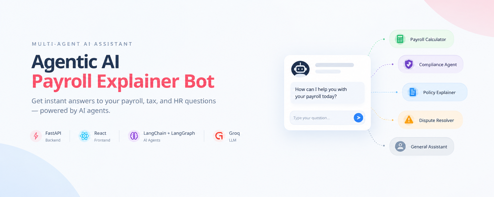
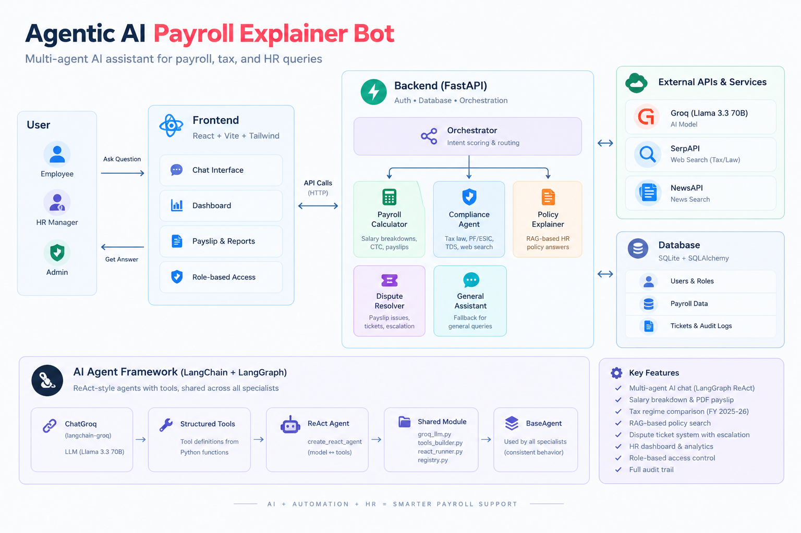

# Agentic AI Payroll Explainer Bot

> A multi-agent AI assistant for payroll, tax, HR policies, payslips, and payroll-related disputes — built with **FastAPI, React, LangChain, LangGraph, and Groq**.



---

## Overview

**Agentic AI Payroll Explainer Bot** is an AI-powered payroll assistance platform designed to help employees and HR teams understand payroll-related information through a conversational interface.

The application combines a **FastAPI backend**, **React frontend**, and a shared **LangChain + LangGraph agent framework**. User queries are first classified by the orchestrator and then routed to the most appropriate specialist agent.

The system supports payroll calculations, compliance questions, HR policy queries, payslip disputes, and general payroll assistance.

---

## Architecture



### Request Flow

```text
User
  │
  ▼
React Frontend
  │
  │ HTTP / API
  ▼
FastAPI Backend
  │
  ▼
Orchestrator
  │
  │ Intent Scoring & Routing
  │
  ├───────────────┬────────────────┬────────────────┐
  ▼               ▼                ▼                ▼
Payroll        Compliance       Policy           Dispute
Calculator      Agent          Explainer         Resolver
  │               │                │                │
  └───────────────┴────────────────┴────────────────┘
                          │
                          ▼
                 LangChain + LangGraph
                          │
                          ▼
                    Groq / Llama 3.3
